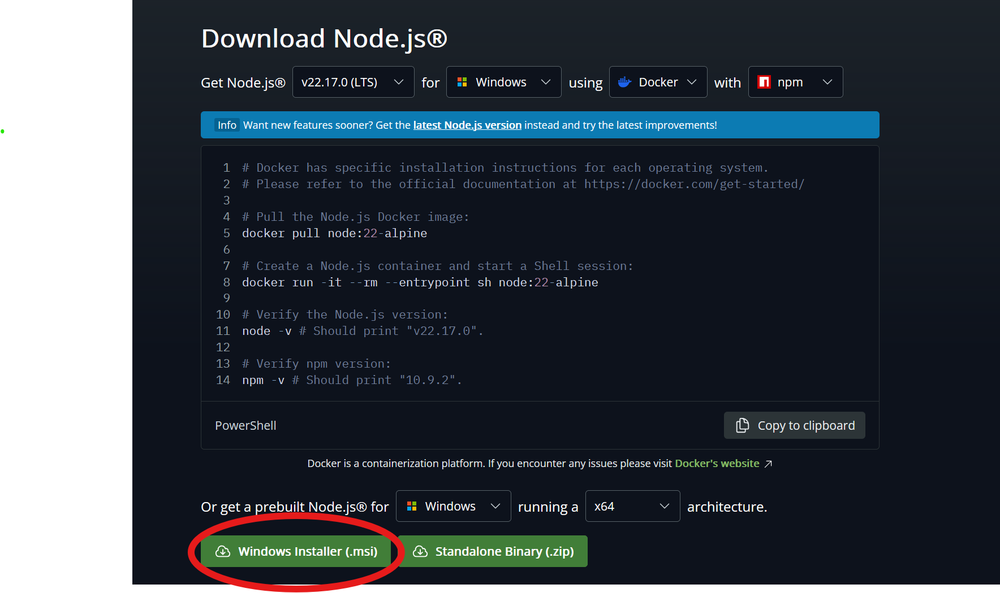
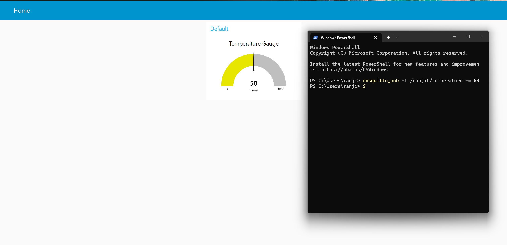

# Node-RED Installation Guide

## Introduction

Node-RED is a flow-based programming tool that allows you to visually wire together devices, APIs, and online services. It’s particularly useful for subscribing to or publishing MQTT topics using a graphical interface.

---

## Installation

### Windows

#### Step 1: Install Node.js

Node-RED runs on Node.js, so it must be installed first.

1. Download the Windows installer from:

   ```
   https://nodejs.org/en/download
   ```

   

2. Run the installer. During setup, you may see a checkbox that says:

   ```
   "Automatically install the necessary tools. Note that this will also install Chocolatey. The script will pop up in a new window after the installation is complete."
   ```

   You can **uncheck** this — it’s not needed for Node-RED.

---

#### Step 2: Install Node-RED

1. Open your terminal and run:

   ```bash
   npm install -g --unsafe-perm node-red
   ```

   > **Note:** If the command fails, try running your terminal as **Administrator**.

2. Once installed, start Node-RED with:

   ```bash
   node-red
   ```

3. Open your browser and go to:

   ```
   http://localhost:1880
   ```

   This will launch the Node-RED editor.

---

### Node-RED Setup

1. Press <kbd>Alt</kbd> + <kbd>Shift</kbd> + <kbd>P</kbd> to open the **Palette Manager**.
2. Click **Install**, then search for `node-red-dashboard` and install it.

   

> ✅ Node-RED is now fully installed and ready to use.

---

## Verification

Follow these steps to test whether Node-RED and MQTT are working correctly:

1. In the Node-RED editor:
   - Add an `mqtt in` node.
   - Add a `gauge` node (from the Dashboard category).
   - Connect the two.

2. Double-click the `mqtt in` node and configure it:

   ```
   Server : localhost:1883
   Topic  : /home/test (or any topic you choose)
   QoS    : Leave as is
   ```

3. Double-click the `gauge` node and configure:

   ```
   Group  : [Home] Default (create if it doesn’t exist)
   Type   : Gauge
   Label  : Temperature Gauge
   Units  : Celsius
   Range  : 0 to 100
   ```

4. Click **Deploy** in the top right corner.

5. Open the dashboard at:

   ```
   http://localhost:1880/ui
   ```

   You should see your temperature gauge.

6. In a terminal window, publish a test message:

   ```bash
   mosquitto_pub -t /home/test -m 50
   ```

   > Replace `/home/test` with the topic you configured in step 2.

7. The gauge should immediately reflect the new value:

   


If you see the gauge respond to your published value, your Node-RED and MQTT setup is working correctly.
